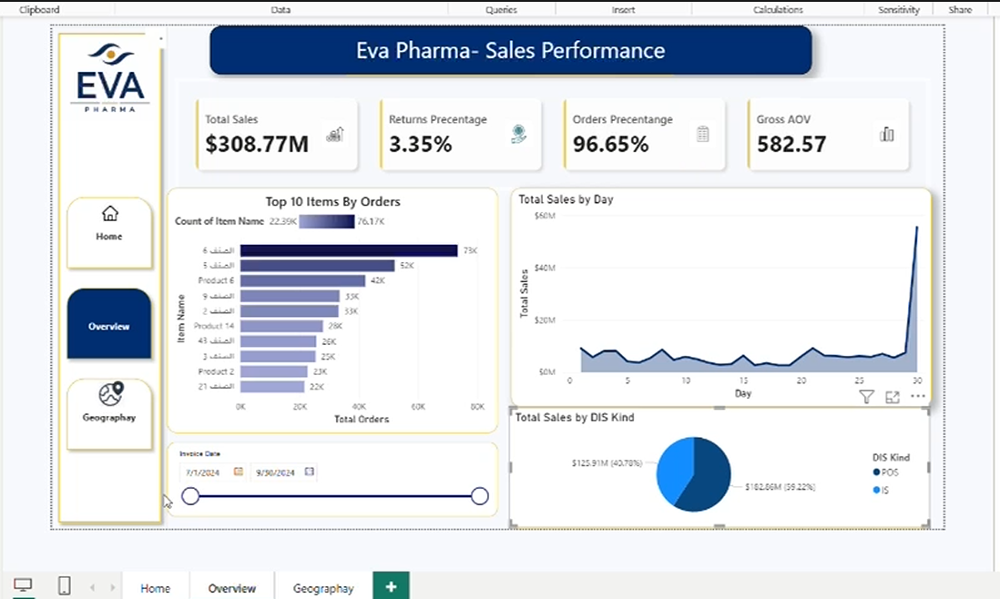

# pharmaceutical-data-analysis
# 🏥 Pharmaceutical Data Analysis Dashboard

📊 Pharmaceutical Sales Analysis Dashboard (Power BI)

📌 Project Overview

Worked on pharmaceutical sales data from two distributors (POS & IS) to build interactive dashboards and generate actionable insights.

⸻

🧩 Data Preparation

* Collected and combined data from two distributors (POS & IS), each with separate monthly files (July, August, September)
* Used Power Query to append and unify the data
* Standardized columns and added a source column to distinguish between POS and IS

⸻

⚠️ Problem Solved

* Faced data inconsistency in Customer ID (errors in September data)
* Cleaned and resolved errors using Power Query (Replace Errors & transformations)
* Ensured data consistency across all datasets before merging into one clean table

⸻

🏗 Data Modeling

* Built a unified dataset and designed a Star Schema (Customer, Geography, Items)
* Used Star Schema to improve performance, simplify relationships, and enable faster analysis
* Created relationships between fact and dimension tables

⸻

📈 Analysis & KPIs

* Developed KPIs using DAX such as:
    Total Sales, Total Orders, Returns %, Average Order Value (AOV), Total Active Customers

⸻

📊 Dashboards

* Built two interactive dashboards:
    * Overview dashboard for sales performance
    * Geography dashboard for regional analysis
* Added slicers and drill-down for dynamic insights
* Dashboards automatically update when new data is added (refresh-ready model)

⸻

🎯 Key Insights

* Compared performance between POS and IS distributors
* Identified top-performing regions and products
* Analyzed sales trends and return rates

---

## 🖼️ Dashboard

---

